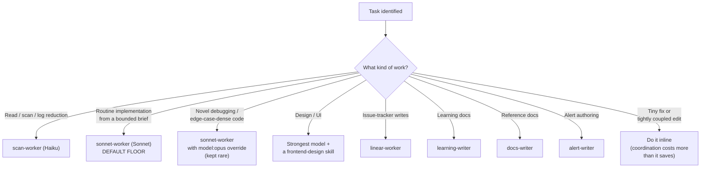
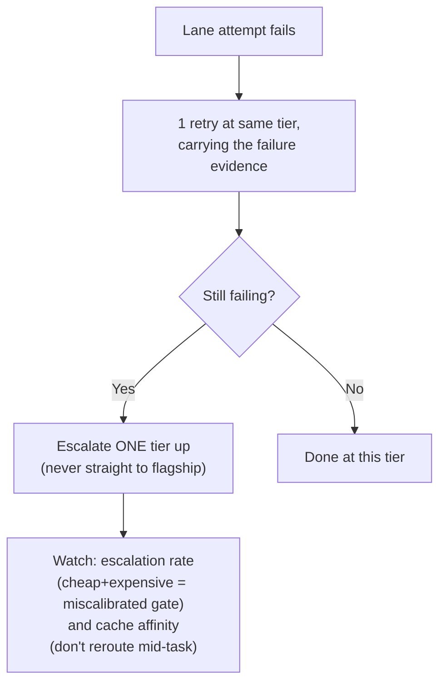
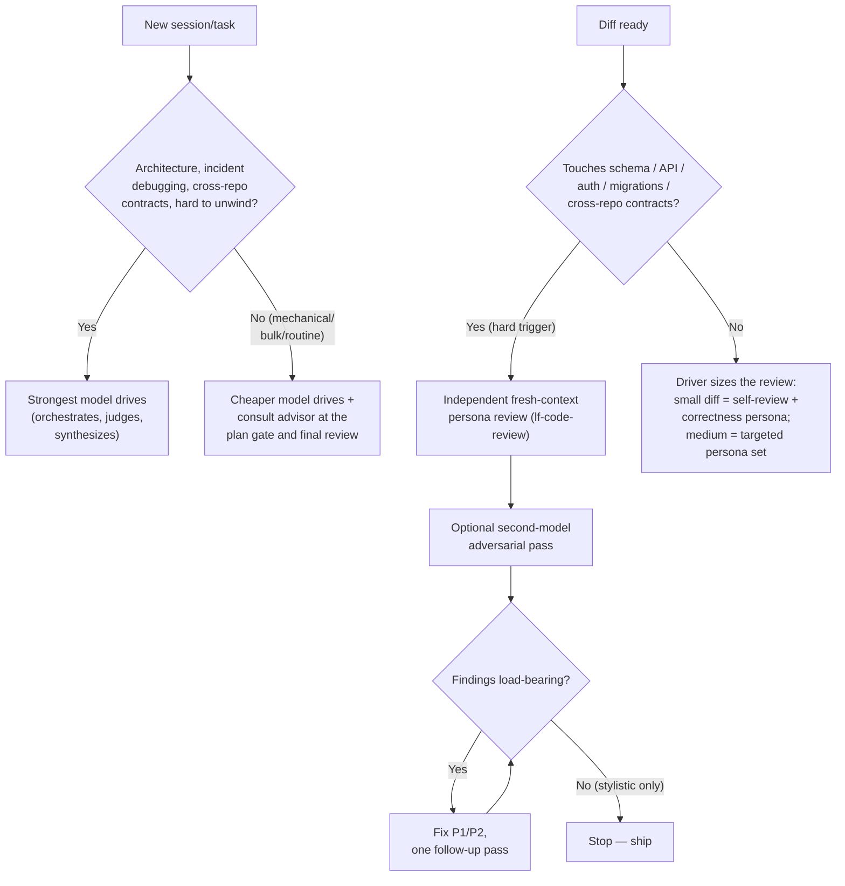

# Orchestration: model routing and token economics

This is the reasoning behind the harness dispatch-lane agents (`docs/agents.md`) and the `model-triage-nudge.sh` hook (`docs/hooks.md`). It's guidance, not a script — adapt the specific model names to whatever tiers your provider(s) offer.

## Orchestrator vs. worker lanes

The core idea: the model driving the session and the model doing the work don't have to be the same model, and usually shouldn't be.

- **The strongest model available orchestrates, judges, and synthesizes.** It decomposes tasks, makes architectural calls, reconciles conflicting findings, and does final review. It should spend very little of its own context reading files end-to-end or writing implementation code directly.
- **A mid-tier model (e.g. Sonnet-class) implements from bounded briefs.** Once the orchestrator has decomposed a task into a self-contained handoff packet, a cheaper model executes it. This is `sonnet-worker`.
- **A cheap, fast model (e.g. Haiku-class) scans, reads, and reduces.** File discovery, grep sweeps, log reduction, config reads, inventory tasks — anything where the orchestrator needs a conclusion, not a raw dump. This is `scan-worker`.

The failure mode this prevents: dispatching a bare general-purpose subagent without pinning its model, which silently inherits the orchestrator's (expensive) tier for grunt work. Always dispatch through a model-pinned lane or set the model explicitly.

### Decision tree: which lane does this task go to?

**When a lane attempt fails:**

## Handoff packets

Every dispatched brief is self-contained — the #1 delegation failure mode is a vague brief that forces the worker to guess at intent or re-derive context the orchestrator already had. A handoff packet includes:

- **Objective** — what done looks like, in one or two sentences.
- **In-scope / out-of-scope files** — exactly which files the worker should touch, and an explicit note on what it must not.
- **Patterns to follow** — example paths in the codebase that already do something similar, so the worker matches existing idiom instead of inventing a new one.
- **Test scenarios** — what behavior needs to be verified, not just "add tests."
- **Verification commands** — the exact commands the worker should run before reporting done (build, test, lint).
- **Stop conditions** — when the worker should stop and report instead of improvising: brief is ambiguous, brief conflicts with what it finds in the code, or it's hit a wall it can't resolve within scope.

`sonnet-worker`'s own instructions state this explicitly: it does not change the plan, and if the brief is wrong or ambiguous, it stops and reports rather than improvising scope.

## Return contract

The mirror of the handoff packet — what a worker sends back. A worker returns a **bounded result, never a raw dump**:

- **status** — success / partial / error, so a botched run can't be mistaken for a clean conclusion.
- **conclusion** — the actual answer or outcome.
- **evidence pointers** — `file:line`, paths — not pasted file, log, or transcript bodies. A dump re-enters the orchestrator's context as input tokens and erases the savings the whole routing scheme exists to capture.

If the output is genuinely large (a generated report, a big inventory), the worker writes it to a file and returns the **path plus a short digest** (a couple hundred tokens), not the payload. The detail is one file-read away, so the orchestrator loses nothing but keeps its own context clean — and can reopen the cited source itself to verify anything load-bearing (see "Trust reports as leads" below).

This is not the same thing as running lossy LLM-compression over structured findings — a bounded, schema'd return is the right fix for that. Compression belongs on genuinely freeform payloads (search results, transcripts), not on findings that already have a shape.

## Escalate on evidence, not prestige

Start every task at the lowest lane that could plausibly succeed in one pass. Step up a tier only when a concrete attempt fails or the task demonstrably exceeds the lane's capability — never reach for the expensive tier by default "to be safe."

Cap the escalation: one retry at the same tier carrying the failure evidence forward, then one tier up. Not a jump straight to the most expensive model available.

Two things to watch for:

- **Escalation rate.** If you're routinely paying for a cheap attempt *and* an expensive redo, the routing gate is miscalibrated — you're spending more than a single strong-model call would have cost. Pull the gate back down.
- **Cache affinity.** Don't reclassify or reroute a task mid-flight in a way that thrashes prompt caching. Once a task is succeeding on a given lane, keep it there.

## Trust reports as leads, not facts

A worker's completion narrative describes what it intended to do, not necessarily what it did. For anything load-bearing, reopen the cited files and check ground truth directly (for code: git log, git status, the actual diff) rather than accepting the report at face value. A second relay-shaped report from the same worker on the same claim is a signal to stop delegating that thread and do the verification directly.

## The advisor pattern

A legitimate deliberate choice for long, mechanical sessions (backfills, bulk fixups, doc maintenance, test sweeps): drive the session with a cheaper model, and consult an advisor agent — a stronger model used sparingly, in judgment-only mode — at two points:

- **The plan gate**, before committing to an approach.
- **Final review**, before calling the work done.

The advisor never implements; it reviews a plan, diff, or decision and returns direction, risks, and course corrections. `advisor` in this repo is exactly that role. This pattern is a poor fit for architecture decisions, incident debugging, or cross-repo contract work — drive those with the strongest model directly rather than leaning on sparse advisor consults.

### Decision tree: who drives the session, and how much review?

## Review policy (risk-tiered)

Not every diff needs the same review weight. Tier by risk:

- **Hard triggers always get an independent, fresh-context review**, regardless of what model drove the implementation: schema/API changes, auth, migrations, cross-repo contracts, anything hard to unwind once shipped. Self-review bias survives model capability — the model that wrote the code is a worse judge of it than a reviewer starting cold. This is the whole reason the persona reviewer agents in `docs/agents.md` exist and run with fresh context rather than as a self-check step.
- **Below those triggers**, the orchestrator can size the review itself — for small, low-risk changes, a lighter pass (or skipping persona ceremony entirely) is a reasonable call.
- **An optional second-model adversarial pass** is worth running on hard-trigger diffs and on complex plans/architecture: a reviewer built on a *different* model family than the one that implemented the change, specifically hunting for what the implementing model would be structurally blind to. This is genuinely optional — it's a cost/rigor knob, not a requirement for every PR. See `docs/customization.md` for wiring one in.

## Effort levels

If your orchestrator model exposes an effort/reasoning-level knob, default to a moderate setting. Drop to a low setting for status/summary/mechanical-dispatch sessions where the orchestrator is mostly routing, not judging. Reserve a high setting for architecture decisions, risk analysis, and final review on hard triggers — raising effort for routine work burns tokens without changing outcomes.

## Output discipline

The orchestrator's own generated tokens are the expensive ones — narration, recap, and inline reads all bill at its rate. Lead with outcomes in plain language. Keep responses short and selective rather than exhaustive. Skip file-by-file narration and restated context unless asked to dig deeper. One tight status at real checkpoints (plan gate, dispatch, verify/merge) beats a status update per action. Never pad a report with what didn't change — but never compress the load-bearing part: decisions and their rationale, risks, verification results, and what a human needs to steer.
