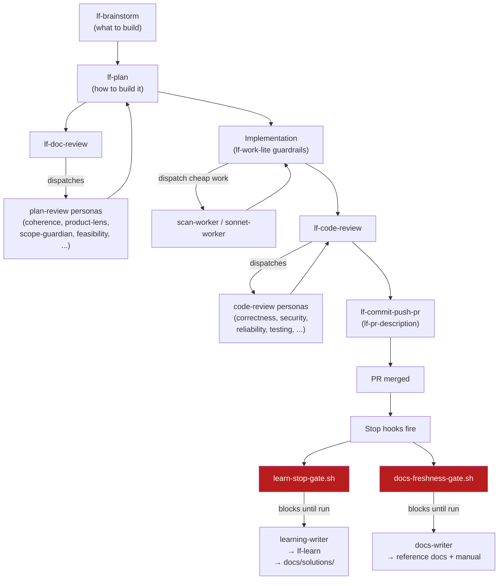

# Overview: how the pieces wire together

Lean Flow is three layers that stay deliberately separable:

1. **Skills** (`plugins/lean-flow/skills/`) — the workflows you or the model invoke: brainstorm, plan, review, commit, learn. Skills are prompts, not code; they carry the process.
2. **Persona agents** (`plugins/lean-flow/agents/`) — narrow-lens reviewers that skills dispatch in parallel. A code review isn't one model reading a diff once; it's several fresh-context reviewers each looking for one class of problem, merged into a report.
3. **Harness** (`harness/`) — the layer around the plugin: hooks that enforce gates the model can't talk its way past, and dispatch-lane agents (`scan-worker`, `sonnet-worker`, `advisor`, `learning-writer`, `docs-writer`, `linear-worker`) that give the orchestrator concrete places to send work at the right cost tier.

None of these layers require the others to function — you can use the plugin's skills without installing the harness, and the harness hooks enforce git/learning-loop hygiene regardless of which skills you run. Together, they're the full workflow: plan-heavy, review-gated, and self-improving.

## Skills invoke reviewer agents

`lf-doc-review` and `lf-code-review` don't review anything themselves — they're dispatch orchestrators. Given a plan document or a diff, each skill:

1. Decides which persona agents apply (some are always-on; most are conditional on what the diff/plan touches — see `docs/agents.md` for the dispatch conditions).
2. Spawns them in parallel, each reading the same artifact through a different lens and returning structured findings.
3. Merges and deduplicates the findings, applies `safe_auto` fixes where the skill defines them, and routes the rest through user decision.

This is why the personas are agents and not just sections of a single prompt: each one runs with a fresh, unpolluted context, so a reviewer looking for security gaps isn't anchored by the correctness reviewer's framing of the same diff.

## Hooks enforce gates at session start / tool use / stop

Skills and agents are prompts — a sufficiently distracted or under-pressure model can skip a step a prompt asks for. Hooks can't be skipped the same way: they run as real shell processes wired into Claude Code's event lifecycle, and a hook that `exit 2`s a `PreToolUse` call blocks the tool from running at all.

- **SessionStart** — `session-git-guard.sh` briefs the session on git ground truth (worktree vs. shared checkout, branch, staleness) before any work starts.
- **PreToolUse / PostToolUse (Bash)** — `git-ground-truth.sh` blocks unsafe commits/pushes; `git-pin-update.sh` keeps the session's branch pin current after deliberate branch changes; `gh-merge-guard.sh` blocks merging a PR into the wrong base.
- **Stop** — `learn-stop-gate.sh` and `docs-freshness-gate.sh` block the first stop attempt after a merged PR that produced no learning doc / no documentation update.
- **Stop** — `plan-completion-gate.sh` blocks once when a session implemented against a plan that still has unchecked items, so "finished" means the checklist, not the summary.

Full behavior and exact wiring: `docs/hooks.md`.

## Harness agents are the dispatch lanes

An orchestrator model doesn't have to be the one reading every file or writing every line. The harness agents give it named, cost-tiered destinations for different kinds of work — see `docs/orchestration.md` for the full routing logic and the token-economics reasoning behind it, including the decision trees for lane routing and session-driver/review tiering.

## How a feature flows through the system

The loop closes at `docs/solutions/`: the next time someone (human or agent) hits a similar problem, `lf-learnings-researcher` and `lf-plan`'s own research phase can find it before re-deriving the same fix.

See also: `docs/skills.md`, `docs/agents.md`, `docs/hooks.md`, `docs/orchestration.md`, `docs/customization.md`.
